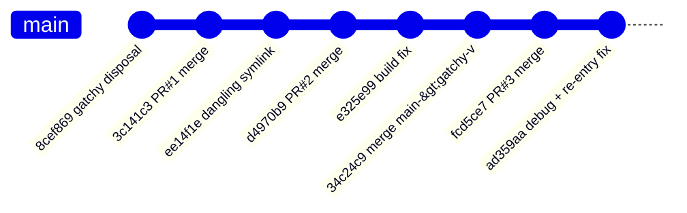

# Gatchy AR Screen — Close / Re-open Fixes

This document tracks every code change authored by Pratik Rajbhandari on `main` (and the `gatchy-v` branch) that address the "Gatchy" use-case: navigating away from the Unity AR screen and back again without the Unity player freezing, crashing, or rendering on top of Flutter.

The changes span three PR merges in March 2026 and one follow-up commit in April 2026.

## Commit timeline



## Net effect at a glance

- **Multi-view routing** — all method-channel calls now target the _currently active_ platform view id (`_activeViewId`) instead of hard-coded `0`.
- **Safe detach** — `UnityKitView` only removes the Unity subview when it is still the owner; prevents yanking it from a new container that has already claimed it.
- **`restartRendering()`** — new `UnityPlayerManager` API that calls `showUnityWindow()` on re-attach and keeps Flutter's UIWindow above Unity's.
- **Bridge re-entry fix** — `_onUnityCreated` detects a legitimate second "created" event when the lifecycle is `paused`/`resumed`, resets the guard, and resumes the native player so queued messages can flush.
- **Packaging fixes** — `unity_kit.podspec` no longer errors on dangling symlinks from pub-cache installs; `UnityFramework.framework` symlink normalised.
- **Test conformance** — all fake/mock platform implementations updated to satisfy the new `registerViewChannel` abstract method; `_TestLoader` stub added for new `loadContentCatalogMessage` abstract method.
- **Debug instrumentation** — tagged `[DBG-1941b8]` log statements added to `UnityBridgeImpl` and `UnityView` to trace the re-open lifecycle in the field.

---

## Commit 1 — gatchy disposal / re-open fix (`8cef869`, 26 Mar 2026)

**Why:** Navigating back to the Unity AR screen after the first close left the player paused and the view tree in an inconsistent state. AR subsystems (e.g. Vuforia) never reinitialised, and `postMessage` calls targeted the wrong method channel (`viewId == 0` instead of the live view id).

**What changed:**

- [unity_kit/ios/Classes/UnityKitView.swift](unity_kit/ios/Classes/UnityKitView.swift)

  `detachUnityView()` now guards against removing the Unity view when a new container has already claimed it, preventing a double-remove that could crash or leave the scene blank.

  ```swift
  // Before
  unityView?.removeFromSuperview()
  unityView = nil

  // After
  if let uv = unityView, uv.superview === self {
      uv.removeFromSuperview()
  }
  unityView = nil
  ```

- [unity_kit/ios/Classes/UnityKitViewController.swift](unity_kit/ios/Classes/UnityKitViewController.swift)

  After attaching the Unity view on re-open, `restartRendering()` is called so AR subsystems re-initialise.

  ```swift
  containerView.attachUnityView(unityView)

  // New line — triggers showUnityWindow() and lowers Unity's UIWindow level
  UnityPlayerManager.shared.restartRendering()

  markChannelReady()
  sendEvent(name: "onUnityCreated", data: nil)
  ```

- [unity_kit/ios/Classes/UnityPlayerManager.swift](unity_kit/ios/Classes/UnityPlayerManager.swift)

  New `restartRendering()` method added. It calls Unity's `showUnityWindow()` to reactivate the rendering surface, marks the player as loaded and unpaused, then lowers Unity's `UIWindow` level so Flutter remains on top.

  ```swift
  func restartRendering() {
      stateLock.lock()
      guard let framework = _unityFramework, _isInitialized else {
          stateLock.unlock()
          return
      }
      _isLoaded = true
      _isPaused = false
      stateLock.unlock()

      framework.showUnityWindow()

      if let window = framework.appController()?.window {
          window.windowLevel = UIWindow.Level(UIWindow.Level.normal.rawValue - 1)
      }
  }
  ```

  > **Note:** `_isPaused = false` was later removed in commit `ad359aa` — see that section.

- [unity_kit/lib/src/platform/unity_kit_platform.dart](unity_kit/lib/src/platform/unity_kit_platform.dart)

  New abstract method added to the platform interface so every platform implementation must declare which view channel to route events through.

  ```dart
  /// Register a MethodChannel for [viewId] so native events from that
  /// platform view are routed into [events].
  void registerViewChannel(int viewId);
  ```

- [unity_kit/lib/src/platform/unity_kit_method_channel.dart](unity_kit/lib/src/platform/unity_kit_method_channel.dart)

  Introduces `_activeViewId` (defaults to `0`) and `registerViewChannel(viewId)`. All nine method-channel call sites (`initialize`, `isReady`, `isLoaded`, `isPaused`, `postMessage`, `pause`, `resume`, `unload`, `quit`) are updated to use `_channelForView(_activeViewId)` instead of `_channelForView(0)`.

  ```dart
  int _activeViewId = 0;

  @override
  void registerViewChannel(int viewId) {
    _channelForView(viewId);
    _activeViewId = viewId;
  }
  ```

- [unity_kit/lib/src/widgets/unity_view.dart](unity_kit/lib/src/widgets/unity_view.dart)

  Both the iOS (`UiKitView`) and Android (`PlatformViewLink`) paths now call `registerViewChannel` inside `onPlatformViewCreated`, so the method channel is pointed at the new view id whenever Flutter recreates the platform view.

  ```dart
  // iOS path
  ..addOnPlatformViewCreatedListener((viewId) {
      UnityKitPlatform.instance.registerViewChannel(viewId);
      params.onPlatformViewCreated(viewId);
  })

  // Android path
  onPlatformViewCreated: (viewId) {
      UnityKitPlatform.instance.registerViewChannel(viewId);
  },
  ```

- [unity_kit/test/bridge/unity_bridge_test.dart](unity_kit/test/bridge/unity_bridge_test.dart) and [unity_kit/test/platform/unity_kit_platform_test.dart](unity_kit/test/platform/unity_kit_platform_test.dart)

  `FakeUnityKitPlatform` and `MockPlatform` test doubles updated to implement the new `registerViewChannel` with a no-op body so the test suite continues to compile.

---

## Commit 2 — dangling symlink fix (`ee14f1e`, 26 Mar 2026)

**Why:** CocoaPods `pod install` was failing with `ENOENT (No such file or directory)` when the plugin was installed from a git or pub-cache path. The old podspec checked `File.symlink?` before `File.exist?`; Ruby's `File.symlink?` returns `true` for dangling symlinks, causing CocoaPods to call `realpath` on a non-existent target and abort.

**What changed:**

- [unity_kit/ios/unity_kit.podspec](unity_kit/ios/unity_kit.podspec)

  Removed `File.symlink?` from the framework detection guard. `File.exist?` is `false` for dangling symlinks, so a missing or broken symlink is now treated the same as "framework not present" — CocoaPods simply skips the vendored-framework configuration rather than crashing.

  ```ruby
  # Before
  if File.exist?(unity_framework_path) || File.symlink?(unity_framework_path)
    s.ios.vendored_frameworks = 'UnityFramework.framework'
    s.preserve_paths = 'UnityFramework.framework'
  end

  # After
  if File.exist?(unity_framework_path)
    s.ios.vendored_frameworks = 'UnityFramework.framework'
    s.preserve_paths = 'UnityFramework.framework'
  end
  ```

  The comment was also updated to document the rationale (dangling symlink detection, pub-cache path variability).

- `unity_kit/ios/.symlinks/plugins/unity_kit/ios/UnityFramework.framework/**` (22 files)

  Twenty-two Xcode `SDKStatCaches` / `TARGET@v11_hash=…-json` symlinks were re-added to the repository. These had gone dangling and their presence (pointing at now-invalid paths) was the root cause of the `realpath` failure. The podspec fix means their state no longer matters, but they were restored to match the expected Xcode project structure.

---

## Commit 3 — Unity framework symlink + test loader stub (`e325e99`, 26 Mar 2026)

**Why:** Follow-up cleanup after `ee14f1e`. The `UnityFramework.framework` symlink had a trailing newline that some tools mishandled, and the 22 `SDKStatCaches` JSON symlinks restored in the previous commit were stale — removing them keeps the repository clean. A test class also needed a new stub to match an abstract method added to `UnityAssetLoader`.

**What changed:**

- [unity_kit/ios/UnityFramework.framework](unity_kit/ios/UnityFramework.framework)

  The symlink target path is unchanged but the trailing newline is removed, normalising it to a single-line symlink pointer as Git/CocoaPods expect.

- `unity_kit/ios/.symlinks/…` (22 files)

  The 22 `SDKStatCaches`/`TARGET@v11_hash=…-json` symlinks added in `ee14f1e` are deleted. With the podspec guarded by `File.exist?` only, they serve no purpose.

- [unity_kit/test/streaming/unity_asset_loader_test.dart](unity_kit/test/streaming/unity_asset_loader_test.dart)

  `_TestLoader` (the private test subclass of `UnityAssetLoader`) gains a stub for `loadContentCatalogMessage`, which was declared abstract on the base class in a separate feature branch. The stub throws `UnimplementedError` to make the intent explicit.

  ```dart
  @override
  UnityMessage loadContentCatalogMessage(
      {required String url, required String callbackId}) {
    throw UnimplementedError();
  }
  ```

---

## Commit 4 — Debug logs + `_isPaused` fix (`ad359aa`, 20 Apr 2026)

**Why:** After the March changes, the Unity scene would still freeze on the second open in certain conditions: `restartRendering()` was unconditionally clearing `_isPaused = false`, which made the `resume()` call that followed a no-op (the guard checked `_isPaused` before sending `resumePlayer`). Additionally, `_onUnityCreated()` treated every duplicate "created" event as a startup duplicate and returned early — even legitimate re-entry events from a paused lifecycle. Debug logs were added to trace this in the field.

**What changed:**

- [unity_kit/ios/Classes/UnityPlayerManager.swift](unity_kit/ios/Classes/UnityPlayerManager.swift)

  `restartRendering()` no longer sets `_isPaused = false`. A doc comment explains the reasoning: clearing the flag prematurely makes the caller's subsequent `resume()` invocation a no-op, leaving the scene frozen on re-attach.

  ```swift
  // Before
  _isLoaded = true
  _isPaused = false   // ← removed
  stateLock.unlock()
  framework.showUnityWindow()

  // After
  _isLoaded = true
  stateLock.unlock()
  framework.showUnityWindow()
  ```

- [unity_kit/lib/src/bridge/unity_bridge.dart](unity_kit/lib/src/bridge/unity_bridge.dart)

  1. `_dbgLog` helper added (tagged `[DBG-1941b8]`) wrapping `debugPrint` with a consistent prefix to make it filterable in device logs.

  2. `_onUnityCreated()` rewritten. The old "if guard is ready, return" early-exit is replaced with a lifecycle-state check:

     - If lifecycle is `paused` or `resumed` → legitimate re-entry from a second open. Reset the guard, reset the lifecycle to `uninitialized`, transition to `initializing`, then call `_platform.resume()` so the native player is unpaused _before_ `_flushQueuedMessages()` runs.
     - Otherwise → true startup duplicate, skip as before.

  ```dart
  // Before
  if (_guard.isReady) return; // Already processed, skip duplicate

  // After
  if (_guard.isReady) {
    final state = _lifecycle.currentState;
    if (state == UnityLifecycleState.paused ||
        state == UnityLifecycleState.resumed) {
      _guard.reset();
      _lifecycle.reset();
      _lifecycle.transition(UnityLifecycleState.initializing);
      unawaited(_platform.resume());
    } else {
      return; // True duplicate during initial startup — skip
    }
  }
  ```

- [unity_kit/lib/src/widgets/unity_view.dart](unity_kit/lib/src/widgets/unity_view.dart)

  `_dbgLog` helper added (same `[DBG-1941b8]` tag). Log statements inserted at two call sites:
  - `_subscribeToStreams()` entry — records bridge state, `_ownsBridge`, and `isReady` at the moment subscriptions are set up.
  - The `lifecycleStream` listener — records when the `ready` state fires and `_unityReady` transitions to `true`.

---

## Merge commits (no code diff)

| Hash | Date | Description |
|------|------|-------------|
| `3c141c3` | 26 Mar 2026 | Merge pull request #1 from `good-company-pratik/gatchy-v` |
| `d4970b9` | 26 Mar 2026 | Merge pull request #2 from `good-company-pratik/gatchy-v` |
| `34c24c9` | 26 Mar 2026 | Merge branch `main` into `gatchy-v` |
| `fcd5ce7` | 26 Mar 2026 | Merge pull request #3 from `good-company-pratik/gatchy-v` |

These four commits carry no file diff; they are recorded here for completeness.

---

## Branch notes

All eight commits are reachable from `main` (and `origin/main`). The `gatchy-v` remote branch additionally contains `8cef869` as an ancestor, but has otherwise been merged into `main` via the three PRs above.

---

## Closing summary

Together, these commits make the following journey reliable in the Gatchy app:

1. User opens the Unity AR screen → `registerViewChannel` wires the active `viewId`, `restartRendering` brings Unity's surface up, `_onUnityCreated` initialises the bridge and flushes messages.
2. User closes the AR screen → `detachUnityView` safely detaches only if still the owner; the bridge transitions to `paused`.
3. User re-opens the AR screen → `registerViewChannel` updates `_activeViewId` for the new platform view; `_onUnityCreated` detects the `paused`/`resumed` re-entry, resets the bridge, calls `resume()` on the native player, and the scene renders correctly.
